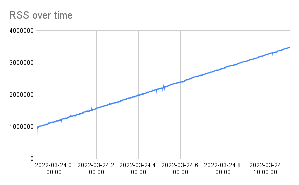

# DuckDB Memory Leak Reproduction

We believe we've discovered a memory leak somewhere in DuckDB 0.3.2 during the running of one of our services. This
long-lived process sees continually growing RSS (resident set size) memory until we disable (via feature flag) all
DuckDB activity, at which point the RSS plateaus.

We've written the code in this repository to approximate what our service is doing. In short it performs the following:

1. Creates an in-memory DuckDB database
2. Creates a background thread pool
3. Submits table creation + data loading tasks at a fixed rate to the thread pool
4. Drops tables as necessary to maintain 100 tables at any given time

## Running the Program

1. Build the program: `./mvnw clean package`
2. Run the program: `./run.sh [duration]` (e.g. `./run.sh PT1H` to run for 1 hour).

The duration argument is optional. If given it should conform to the format specified by
[java.time.Duration#parse(CharSequence)](https://docs.oracle.com/javase/8/docs/api/java/time/Duration.html#parse-java.lang.CharSequence-)
.

The script will output the Java process RSS once per second with timestamps, which is helpful for charting RSS use over
time:

```
% ./run.sh PT1H
2022-03-24 08:52:16, 2032
2022-03-24 08:52:18, 162528
2022-03-24 08:52:19, 196304
2022-03-24 08:52:20, 214256
2022-03-24 08:52:21, 222240
2022-03-24 08:52:22, 250032
2022-03-24 08:52:23, 290928
2022-03-24 08:52:24, 331760
2022-03-24 08:52:25, 374320
2022-03-24 08:52:26, 416000
...
```

## Results

We ran this program for 12 hours and then plotted the output, resulting in the following:



## Using jemalloc leak detection

In order to use [jemalloc](http://jemalloc.net/) we needed to comment
out [line 42 in DuckDBNative.java](https://github.com/duckdb/duckdb/blob/39cfae40b31bd5be73f7686af889e8b801da21b7/tools/jdbc/src/main/java/org/duckdb/DuckDBNative.java#L42)
, otherwise jemalloc wouldn't give us any DuckDB symbol information.

We also ran this same program for 2 hours using, which resulted in the following:


[Here](jemalloc.pdf) is a PDF version, for searching among the stack frames.
