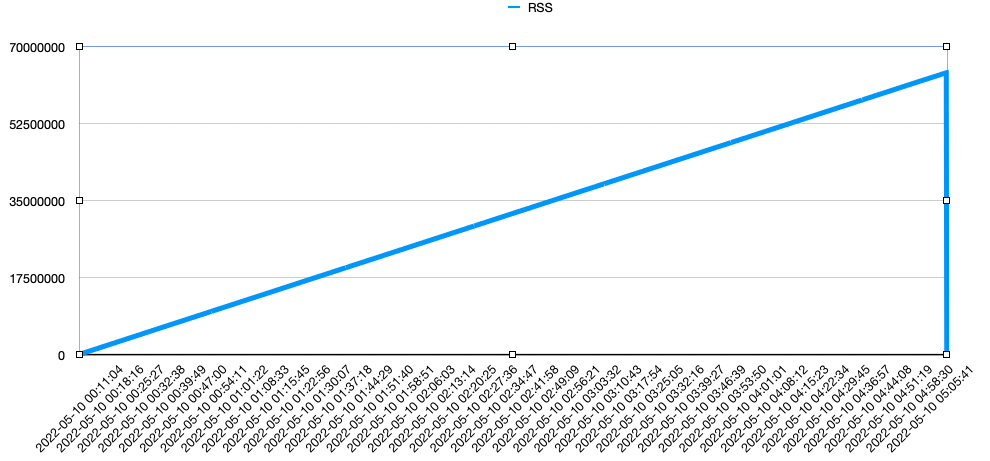
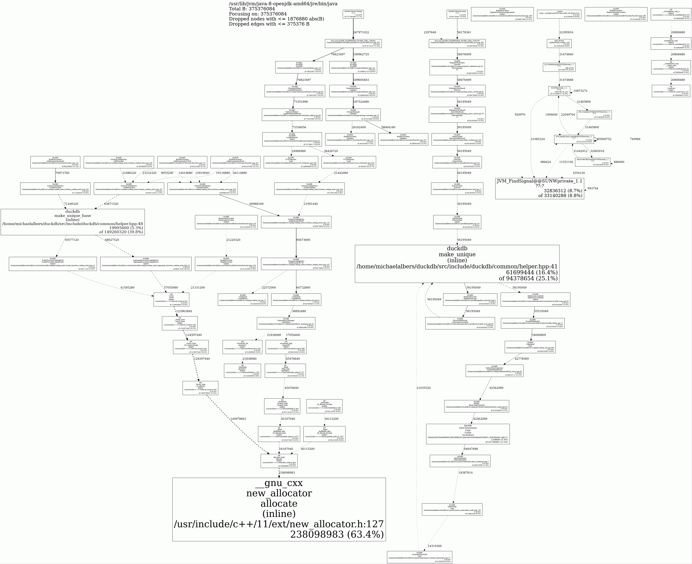

# DuckDB Memory Leak Reproduction

We believe we've discovered a memory leak somewhere in DuckDB 0.3.3 during the running of one of our services. This
long-lived process sees continually growing RSS (resident set size) memory until we disable (via feature flag) all
DuckDB activity, at which point the RSS plateaus.

We've written the code in this repository to approximate what our service is doing. In short it performs the following:

1. Creates an in-memory DuckDB database
2. Perform two queries using a single `Statement` object
3. Deletes the DuckDB database

## Running the Program

1. Build the program: `./mvnw clean package`
2. Run the program: `./run.sh [duration]` (e.g. `./run.sh PT1H` to run for 1 hour).

The duration argument is optional. If given it should conform to the format specified by
[java.time.Duration#parse(CharSequence)](https://docs.oracle.com/javase/8/docs/api/java/time/Duration.html#parse-java.lang.CharSequence-)
.

The script will output the Java process RSS once per second with timestamps, which is helpful for charting RSS use over
time:

```
% ./run.sh PT1H
Timestamp,RSS
2022-03-24 08:52:16, 2032
2022-03-24 08:52:18, 162528
2022-03-24 08:52:19, 196304
2022-03-24 08:52:20, 214256
2022-03-24 08:52:21, 222240
2022-03-24 08:52:22, 250032
2022-03-24 08:52:23, 290928
2022-03-24 08:52:24, 331760
2022-03-24 08:52:25, 374320
2022-03-24 08:52:26, 416000
...
```

## Results

We ran this program for 12 hours and then plotted the output, resulting in the following:



## Using jemalloc leak detection

In order to use [jemalloc](http://jemalloc.net/) we needed to comment
out [line 42 in DuckDBNative.java](https://github.com/duckdb/duckdb/blob/39cfae40b31bd5be73f7686af889e8b801da21b7/tools/jdbc/src/main/java/org/duckdb/DuckDBNative.java#L42)
, otherwise jemalloc wouldn't give us any DuckDB symbol information. We built this custom version of `duckdb_jdbc.jar`
using the `reldebug` Makefile target.

We ran the program for one hour with the following configuration:

```
MALLOC_CONF=prof_leak:true,lg_prof_sample:0,prof_final:true \
LD_PRELOAD=/usr/lib/x86_64-linux-gnu/libjemalloc.so.2 \
/usr/lib/jvm/java-8-openjdk-amd64/jre/bin/java -jar target/duckdb-leak-reproduction-1.0-SNAPSHOT.jar PT2H
```

We then post processed the jemalloc `.heap` files using the following:

```
jeprof --show_bytes --lines --pdf /usr/lib/jvm/java-8-openjdk-amd64/jre/bin/java *.heap > jemalloc.pdf
jeprof --show_bytes --lines --gif /usr/lib/jvm/java-8-openjdk-amd64/jre/bin/java *.heap > jemalloc.gif
```

This one hour run resulted in the leak graph below. This shows what appears to be a memory leak in the
query process. The leak only happens when running two queries against the same `Statement` object. When
using an individual `Statement` object per query, the leak does not manifest. The docs for the Java client
imply that using a single `Statement` object for multiple queries is acceptable. It is important to note
that this leak is not remedied by cleanup and removal of the DuckDB database instance the queries were
run against.



[Here](jemalloc.pdf) is a PDF version, for searching among the stack frames.
